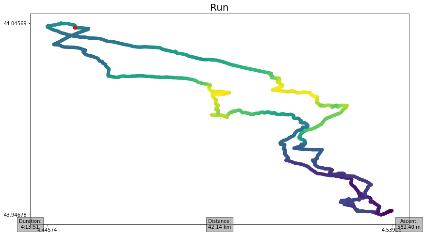

# 🗺️ ezGPX

## 🔎 Description
Easy to use Python GPX library.

- PyPi: https://pypi.org/project/ezgpx/
- Documentation: https://ezgpx.readthedocs.io/en/latest/
- Source code: https://github.com/FABallemand/ezGPX
- Bug reports: https://github.com/FABallemand/ezGPX/issues

## 🛠️ Installation

```bash
pip install ezgpx
```

## 🏁 Get started

```python
import ezgpx

# Parse GPX file
gpx = ezgpx.GPX("file.gpx")

# Simplify (using Ramer-Dougle-Peucker algorithm)
gpx.simplify()

# Plot with Matplotlib
gpx.matplotlib_plot(color="elevation",
                    start_stop_colors=("green", "red"),
                    way_points_color="blue",
                    title=gpx.name(),
                    duration=(0, 0),
                    distance=(0.5, 0),
                    ascent=None,
                    pace=(1, 0),
                    speed=None,
                    file_path="img_1")

# Remove metadata
gpx.remove_metadata()

# Write new simplified GPX file
gpx.to_gpx("new_file.gpx")
```


## 📚 References:

### 🧭 Other Python GPX Library
- [gpxpy](https://github.com/tkrajina/gpxpy)

## 👤 Author
- Fabien ALLEMAND