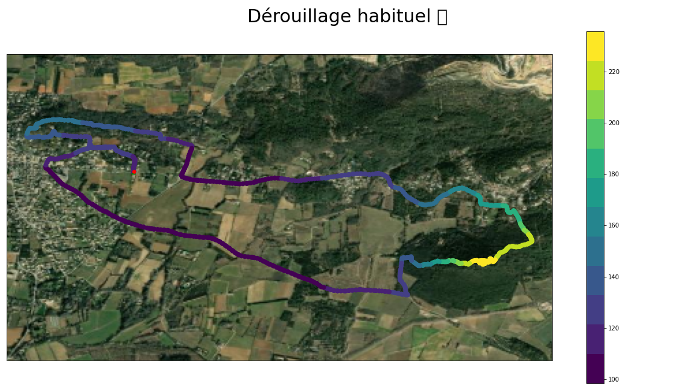

# 🗺️ ezGPX


[](https://ezgpx.readthedocs.io/en/latest/?badge=latest)


[](https://github.com/astral-sh/ruff)
[](https://github.com/pylint-dev/pylint)
[](https://pycqa.github.io/isort/)

## 🔎 Description
ezGPX is an easy to use Python library for working with GPX files.

Read, modify, write, and extract insights from your activity data with ease!

- PyPi: https://pypi.org/project/ezgpx/
- Documentation: https://ezgpx.readthedocs.io/en/latest/
- Source code: https://github.com/FABallemand/ezGPX
- Bug reports: https://github.com/FABallemand/ezGPX/issues

## 🛠️ Installation

```bash
pip install ezgpx
```

## 🏁 Get started

```python
import ezgpx
import matplotlib

# Parse GPX file
gpx = ezgpx.GPX("file.gpx")

# Plot using matplotlib
# See documentation and examples for more plotting methods!
plotter = ezgpx.MatplotlibPlotter(gpx)
plotter.plot(
    figsize=(16, 9),
    size=50,
    color="ele",
    cmap=matplotlib.cm.get_cmap("viridis", 12),
    colorbar=True,
    start_point_color="green",
    stop_point_color="red",
    way_points_color="blue",
    background="World_Imagery",
    title=gpx.name(),
    title_fontsize=30,
    file_path="matplotlib.png"
)

# Simplify (using Ramer-Dougle-Peucker algorithm)
gpx.simplify()

# Remove metadata
gpx.remove_metadata()

# Write new simplified GPX file
gpx.to_gpx("new_file.gpx")
```



## 👤 Author
- Fabien ALLEMAND
