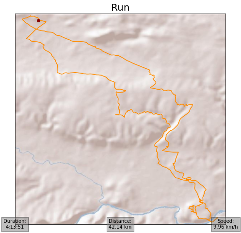

Plotting
--------

ezGPX currently provides four different ways to plot a :py:class:`~ezgpx.gpx.GPX` object.

Matplotlib
^^^^^^^^^^

::

    import ezgpx

    # Parse GPX file
    gpx = ezgpx.GPX("file.gpx")

    # Plot with Matplotlib
    gpx.matplotlib_plot(color="elevation",
                        start_stop_colors=("green", "red"),
                        way_points_color="blue",
                        title=gpx.name(),
                        duration=(0, 0),
                        distance=(0.5, 0),
                        ascent=(1, 0),
                        pace=None,
                        speed=None,
                        file_path="img_1")

.. image:: ../../img/matplotlib_plot_1.png
  :width: 500
  :alt: Matplotlib plot

Matplotlib Basemap Toolkit
^^^^^^^^^^^^^^^^^^^^^^^^^^

::

    import ezgpx

    # Parse GPX file
    gpx = ezgpx.GPX("file.gpx")

    # Plot with Matplotlib Basemap Toolkit
    gpx.matplotlib_basemap_plot(color="darkorange",
                                start_stop_colors=("darkgreen", "darkred"),
                                way_points_color="darkblue",
                                title=gpx.name(),
                                duration=(0,0),
                                distance=(0.5,0),
                                ascent=None,
                                pace=None,
                                speed=(1,0),
                                file_path="img_2")

gmplot
^^^^

.. warning:: Requires :py:mod:`~gmplot`.

::

    import ezgpx

    # Parse GPX file
    gpx = ezgpx.GPX("file.gpx")

    # Plot with gmplot (Google Maps)
    gpx.gmplot_plot(color="yellow",
                start_stop_colors=("green", "red"),
                way_points_color="blue",
                zoom=13,
                title=gpx.name(),
                file_path="map_1.html",
                open=False)

.. image:: ../../img/gmplot_plot_1.png
  :width: 500
  :alt: gmplot plot

Folium
^^^^^^

.. warning:: Requires :py:mod:`~folium`.

::

    import ezgpx

    # Parse GPX file
    gpx = ezgpx.GPX("file.gpx")

    # Plot with Folium
    gpx.folium_plot(tiles="OpenStreetMap",
                    color="orange",
                    start_stop_colors=("green", "red"),
                    way_points_color="blue",
                    minimap=True,
                    coord_popup=False,
                    title="Very nice track!",
                    zoom=8,
                    file_path="map_2.html",
                    open=True)

.. image:: ../../img/folium_plot_1.png
  :width: 500
  :alt: Folium plot