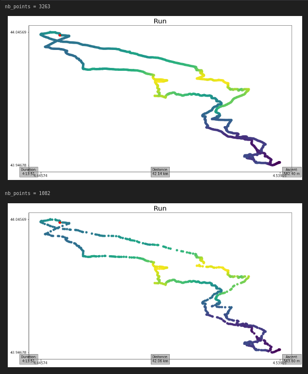

Modifying
---------

Removing Data
^^^^^^^^^^^^^

Not all the data contained in a GPX file is always relevant. With :py:class:`~ezgpx.gpx.GPX` objects, it is possible to remove unused data such as metadata, elevation and time data, as well as all data contained in extensions. This is particularily useful when using devices with limited storage space or computing power. A GPX file of a 10 km run downloaded from Strava weighing 345.4 kB can be reduced to a 52.5 kB file (ie: only 15.2 % of the original file size).

.. code-block:: python

    from ezgpx import GPX

    # Parse GPX file
    gpx = GPX("file.gpx")

    # Remove metadata
    gpx.remove_metadata()

    # Remove elevation data
    gpx.remove_elevation()

    # Remove time data
    gpx.remove_time()

    # Remove extensions data
    gpx.remove_extensions()

    # Write new simplified GPX file
    gpx.to_gpx("new_file.gpx")

Simplifying Track
^^^^^^^^^^^^^^^^^

It is sometimes usefull to reduce the amount of track points contained in a GPX file especially when dealing with low power or low capacity devices. The :py:meth:`~simplify` method reduces the number of points while maintaining good precision.

.. code-block:: python

    import ezgpx

    # Parse GPX file
    gpx = ezgpx.GPX("file.gpx")

    # Simplify (using Ramer-Douglas-Peucker algorithm)
    gpx.simplify()

    # Write new simplified GPX file
    gpx.to_gpx("new_file.gpx")

In the following example, a 42 km run downloaded from Strava went from 3263 track points to only 1082. This correspond to a 69% decrease in points and allows to save 704.6 kB (ie: 85.4 % of the original file size) by reducing the file size from 824.8 kB to 120.2 kB.  It is clear that the algorithm used only removes points that do not provide significant information preserving the shape of the track.

.. code-block:: python

    from ezgpx import GPX

    # Load and parse GPX file
    gpx = GPX("file.gpx")

    # Print number of track points
    print(f"nb_points = {gpx.nb_points()}")

    # Plot tracks
    gpx.matplotlib_plot(start_stop_colors=("green", "red"), way_points_color="blue", elevation_color=True, title="Run", duration=(0,0), distance=(0.5,0), ascent=(1,0))

    # Simplify tracks
    gpx.simplify()

    # Print new number of track points
    print(f"nb_points = {gpx.nb_points()}")

    # Plot tracks
    gpx.matplotlib_plot(start_stop_colors=("green", "red"), way_points_color="blue", elevation_color=True, title="Run", duration=(0,0), distance=(0.5,0), ascent=(1,0))

    # Save GPX
    gpx.to_gpx("file_simplified.gpx")

Removing Errors
^^^^^^^^^^^^^^^

GPS devices sometimes lose signal generating errors in GPX files. The most noticeable errors (single isolated points) can be found and removed as follow.

.. code-block:: python

    import ezgpx

    # Parse GPX file
    gpx = ezgpx.GPX("file.gpx")

    # Remove GPS errors
    gpx.remove_gps_errors()

    # Write new simplified GPX file
    gpx.to_gpx("new_file.gpx")
