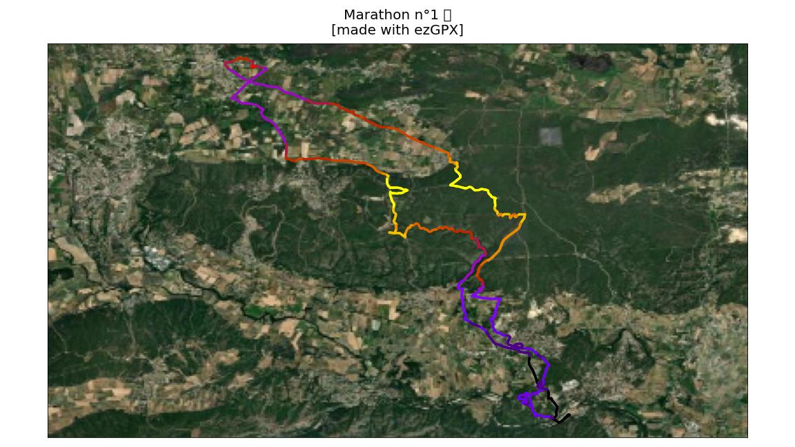
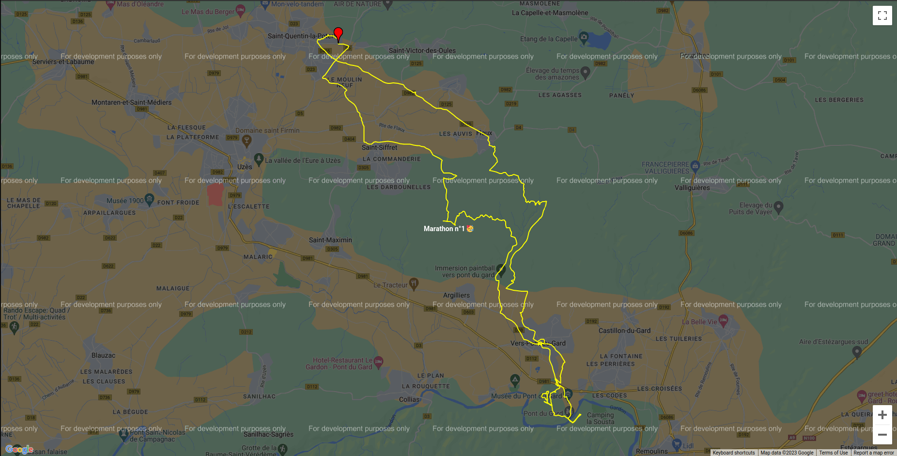
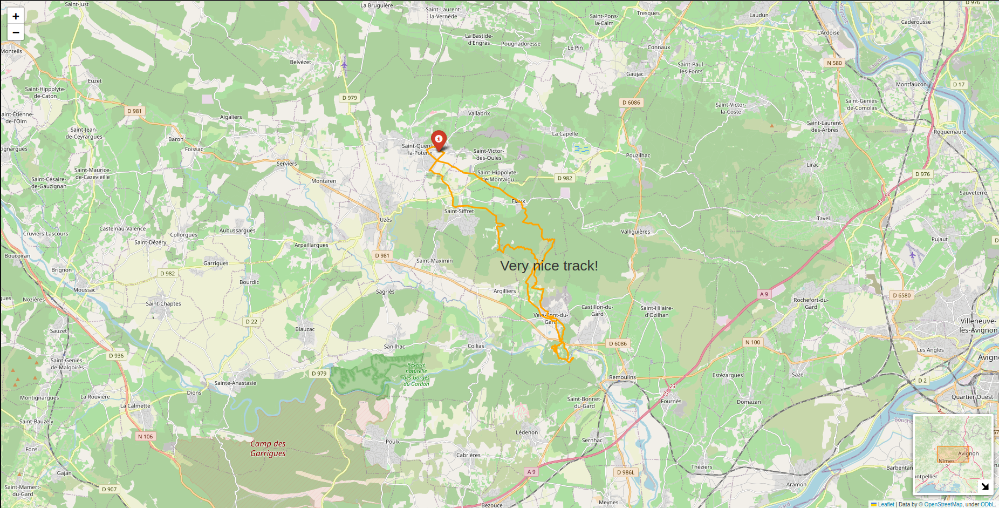
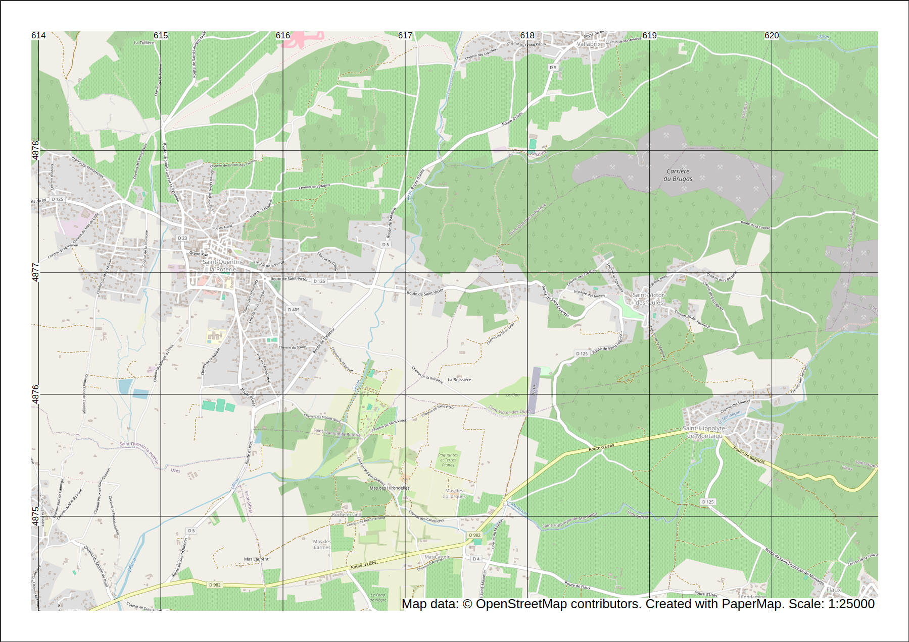
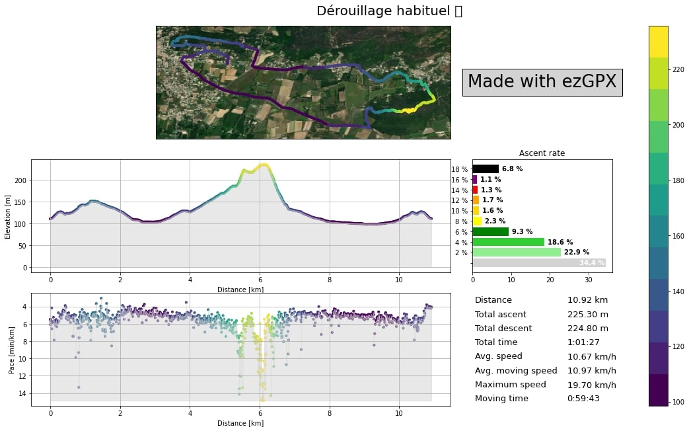

Plotting
--------

ezGPX currently provides many different ways to plot a :py:class:`~ezgpx.gpx.GPX` object.

Matplotlib
^^^^^^^^^^

This method relies on the well known Matplotlib Python library to create simple yet useable plots of GPX files.

.. warning:: Requires :py:mod:`~basemap`.

::

    import ezgpx
    import matplotlib as mpl

    # Parse GPX file
    gpx = ezgpx.GPX("file.gpx")

    # Plot with Matplotlib
    gpx.matplotlib_plot(figsize=(16,9),
                        size=5,
                        color="ele",
                        cmap=mpl.cm.get_cmap("viridis", 12),
                        colorbar=False,
                        start_point_color="green",
                        stop_point_color="red",
                        way_points_color=None,
                        background="World_Imagery",
                        offset_percentage=0.04,
                        dpi=100,
                        title=gpx.name(),
                        title_fontsize=20,
                        watermark=True,
                        file_path="img.png")

gmplot
^^^^^^

This method uses the Google map engine to display the content of the GPX file in a HTML page.

.. warning:: Requires :py:mod:`~gmplot`.

::

    import ezgpx

    # Parse GPX file
    gpx = ezgpx.GPX("file.gpx")

    # Plot with gmplot (Google Maps)
    gpx.gmplot_plot(color="yellow",
                start_stop_colors=("green", "red"),
                way_points_color="blue",
                zoom=13,
                title=gpx.name(),
                file_path="map.html",
                open=False)

Folium
^^^^^^

The interactive HTML page resulting from this method allows you to visualize the content of a GPX on a nice looking map.

.. warning:: Requires :py:mod:`~folium`.

::

    import ezgpx

    # Parse GPX file
    gpx = ezgpx.GPX("file.gpx")

    # Plot with Folium
    gpx.folium_plot(tiles="OpenStreetMap",
                    color="orange",
                    start_stop_colors=("green", "red"),
                    way_points_color="blue",
                    minimap=True,
                    coord_popup=False,
                    title="Very nice track!",
                    zoom=8,
                    file_path="map.html",
                    open=True)

PaperMap
^^^^^^^^

.. warning:: Requires :py:mod:`~papermap`.

::

    import ezgpx

    # Parse GPX file
    gpx = ezgpx.GPX("file.gpx")

    # Plot with Papermap
    gpx.papermap_plot(tile_server="OpenStreetMap",
                      size = "a4",
                      use_landscape = True,
                      scale = 25000,
                      dpi = 300,
                      add_grid = True,
                      grid_size = 1000,
                      file_path = "map.pdf")

Matplotlib Animation
^^^^^^^^^^^^^^^^^^^^

This method creates animations of the activity contained in a GPX file.

.. warning:: Requires :py:mod:`~basemap`.

::

    import ezgpx

    # Parse GPX file
    gpx = ezgpx.GPX("file.gpx")

    # Create animation with Matplotlib
    gpx.matplotlib_animation(figsize=(16,9),
                             size=4,
                             color="red",
                             cmap=None,
                             colorbar=False,
                             start_point_color=None,
                             stop_point_color=None,
                             way_points_color=None,
                             background="World_Imagery",
                             offset_percentage=0.04,
                             dpi=200,
                             interval=10,
                             fps=24,
                             repeat=False,
                             title=gpx.name(),
                             title_fontsize=15,
                             watermark=True,
                             file_path="video_1.mp4")

.. image:: ../../../img/matplotlib_animation_1.gif
  :width: 500
  :alt: Matplotlib animation

Expert Plot
^^^^^^^^^^^

This is the most advanced plotting method built into ezGPX. It allows to plot the path with or without a background map, the elevation profile, the pace profile and other relevant data related to the GPX file as tables or graphs.

.. warning:: Requires :py:mod:`~basemap`.

::

    import ezgpx

    # Parse GPX file
    gpx = ezgpx.GPX("file.gpx")

    # Expert plot
    gpx.expert_plot(figsize=(16,9),
                    subplots=(3,2),
                    map_position=(0,0),
                    map_size=10,
                    map_color="ele",
                    map_cmap=matplotlib.cm.get_cmap("viridis", 12),
                    map_colorbar=True,
                    start_point_color=None,
                    stop_point_color=None,
                    way_points_color=None,
                    background="World_Imagery",
                    offset_percentage=0.04,
                    xpixels=1000,
                    ypixels=None,
                    dpi=100,
                    elevation_profile_position=(1,0),
                    elevation_profile_size=10,
                    elevation_profile_color="ele",
                    elevation_profile_cmap=matplotlib.cm.get_cmap("viridis", 12),
                    elevation_profile_colorbar=False,
                    elevation_profile_grid=True,
                    elevation_profile_fill_color="lightgray",
                    elevation_profile_fill_alpha=0.5,
                    pace_graph_position=(2,0),
                    pace_graph_size=10,
                    pace_graph_color="ele",
                    pace_graph_cmap=None,
                    pace_graph_colorbar=False,
                    pace_graph_grid=True,
                    pace_graph_fill_color="lightgray",
                    pace_graph_fill_alpha=0.5,
                    pace_graph_threshold=15,
                    ascent_rate_graph_position=(1,1),
                    made_with_ezgpx_position=(0,1),
                    shared_color="ele",
                    shared_cmap=None,
                    shared_colorbar=True,
                    data_table_position=(2,1),
                    title=test_gpx.name(),
                    title_fontsize=20,
                    watermark=False,
                    file_path="img.png")

