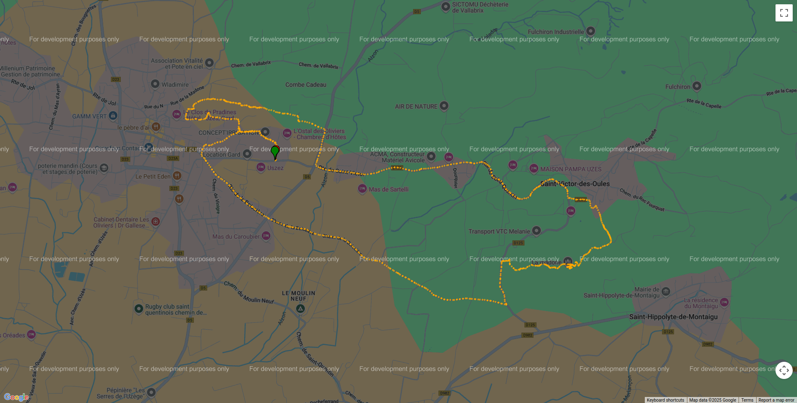

Plotting
--------

ezGPX currently provides many different ways to plot a :py:class:`~ezgpx.gpx.GPX` object.

.. warning:: These features are likely to be deprecated and removed in future versions.

Matplotlib
^^^^^^^^^^

Relying on the well known Matplotlib library, you can create static or animated plots of GPX files.

.. warning:: Requires :py:mod:`~basemap`.

.. code-block:: python

    import ezgpx
    import matplotlib as mpl

    # Parse GPX file
    gpx = ezgpx.GPX("file.gpx")

    # Plot with Matplotlib
    plotter = ezgpx.MatplotlibPlotter(gpx)
    plotter.plot(
        figsize=(16, 9),
        size=50,
        color="ele",
        cmap=mpl.cm.get_cmap("viridis", 12),
        colorbar=True,
        start_point_color="green",
        stop_point_color="red",
        way_points_color="blue",
        background="World_Imagery",
        title=gpx.name(),
        title_fontsize=30,
        file_path="matplotlib.png"
    )

    # Animated plot with Matplotlib
    plotter = ezgpx.MatplotlibAnimPlotter(gpx)
    plotter.plot(
        figsize=(9, 16),
        size=10,
        color="#FFA800",
        background="World_Imagery",
        dpi=50,
        fps=34,
        repeat=True,
        title="Trail Running",
        title_fontsize=30,
        file_path="matplotlib.gif",
    )

.. image:: ../../../img/matplotlib.png
  :width: 500
  :alt: Matplotlib plot

.. image:: ../../../img/matplotlib.gif
  :width: 500
  :alt: Matplotlib animated plot

Plotly
^^^^^^

Relying on the well known Plotly library, you can create static, interactive or animated plots of GPX files.

.. warning:: Requires :py:mod:`~basemap`.

.. code-block:: python

    import ezgpx

    # Parse GPX file
    gpx = ezgpx.GPX("file.gpx")

    # Plot with Plotly
    plotter = ezgpx.PlotlyPlotter(gpx)
    plotter.plot(
        tiles="open-street-map",
        mode="lines+markers",
        color="#FFA800",
        start_stop_colors=("green", "red"),
        way_points_color="blue",
        title=gpx.name(),
        zoom=12,
        file_path="plotly.png",
    )

    # Animated plot with Plotly
    plotter = ezgpx.PlotlyAnimPlotter(gpx)
    plotter.plot(
        tiles="open-street-map",
        color="#FFA800",
        title=gpx.name(),
        zoom=12,
        file_path="plotly.gif",
    )

.. .. image:: ../../../img/plotlyt.gif
..   :width: 500
..   :alt: Plotly animated plot

gmplot
^^^^^^

This method uses the Google map engine to display the content of the GPX file in a HTML page.

.. warning:: Requires :py:mod:`~gmplot`.

.. code-block:: python

    import ezgpx

    # Parse GPX file
    gpx = ezgpx.GPX("file.gpx")

    # Plot with gmplot (Google Maps)
    plotter = ezgpx.GmapPlotter(gpx)
    plotter.plot(
        color="#FFA800",
        start_stop_colors=("green", "red"),
        way_points_color="blue",
        scatter=True,
        plot=False,
        zoom=15,
        file_path="gmplot.html",
        browser=True,
    )

Folium
^^^^^^

The interactive HTML page resulting from this method allows you to visualize the content of a GPX on a nice looking map.

.. warning:: Requires :py:mod:`~folium`.

.. code-block:: python

    import ezgpx

    # Parse GPX file
    gpx = ezgpx.GPX("file.gpx")

    # Plot with Folium
    plotter = ezgpx.FoliumPlotter(gpx)
    plotter.plot(
        tiles="OpenStreetMap",
        color="#FFA800",
        start_stop_colors=("green", "red"),
        way_points_color="blue",
        minimap=True,
        coord_popup=True,
        zoom=15,
        file_path="folium.html",
        browser=True,
    )

Map Plotting
^^^^^^^^^^^^

Contextily
==========

.. warning:: Requires :py:mod:`~contextily`.

For more information consults contextily documentation.

.. code-block:: python

    import ezgpx
    import contextily as cx
    import matplotlib.pyplot as plt

    # Parse GPX file
    gpx = ezgpx.GPX("file.gpx")

    # Plot map with Contextily
    min_lat, min_lon, max_lat, max_lon = gpx.bounds()
    im, bbox = cx.bounds2img(
        min_lon,
        min_lat,
        max_lon,
        max_lat,
        ll=True,
        source=cx.providers.OpenStreetMap.Mapnik,
    )
    plt.imshow(im)
    plt.savefig("contextily.png")

Papermap
========

.. warning:: Requires :py:mod:`~papermap`.

For more information consults papermap documentation.

.. code-block:: python

    import ezgpx
    from papermap import PaperMap

    # Parse map GPX file
    gpx = ezgpx.GPX("file.gpx")

    # Plot map with Papermap
    center_lat, center_lon = gpx.center()
    pm = PaperMap(
        lat=center_lat,
        lon=center_lon,
        size="a4",
        use_landscape=True,
        scale=50_000,
        add_grid=True,
    )
    pm.render()
    pm.save("papermap.pdf")

Prettymaps
==========

.. warning:: Requires :py:mod:`~prettymaps`.

For more information consults prettymaps documentation.

.. code-block:: python

    import ezgpx
    import prettymaps

    # Parse map GPX file
    gpx = ezgpx.GPX("file.gpx")

    # Plot with Papermap
    center = gpx.center()
    plot = prettymaps.plot(center)
